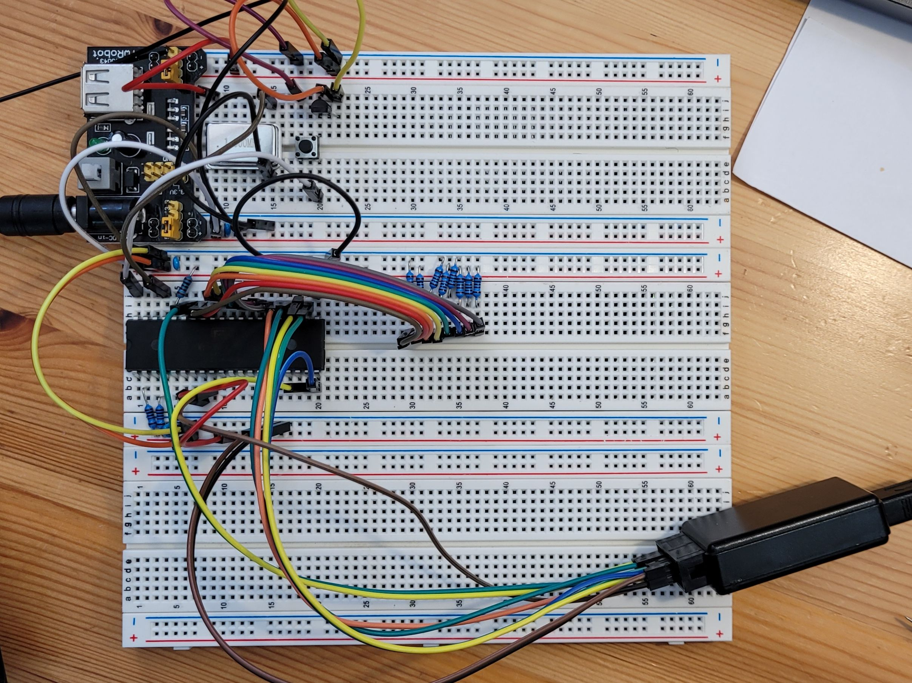
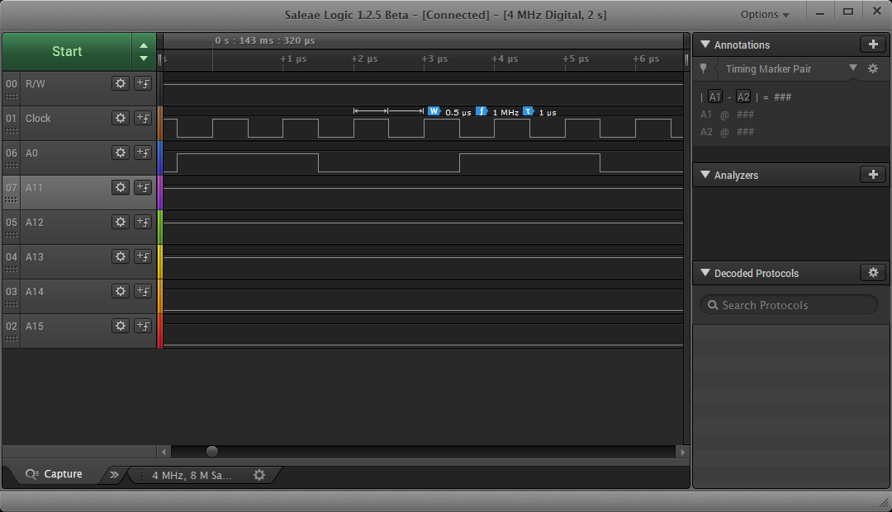
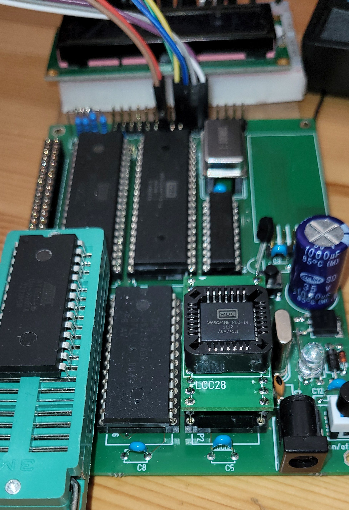
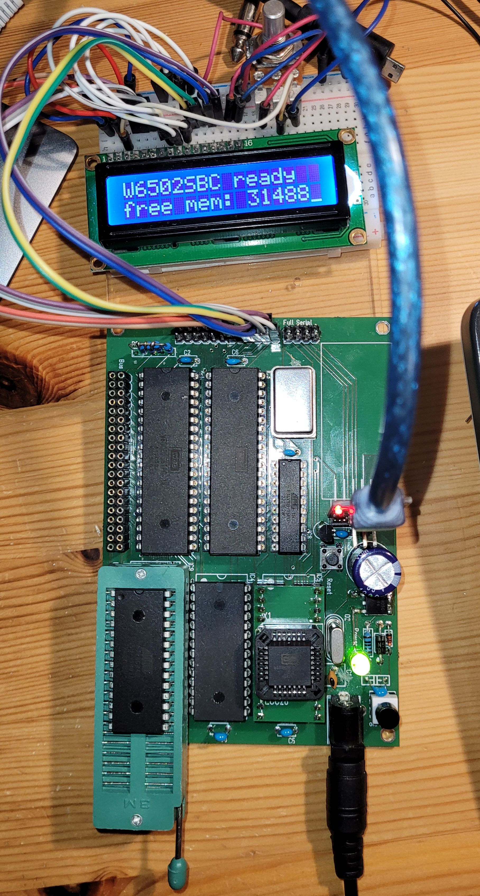

# Blog die erste (18.07.22)

Schon seit längerem beschäftigt mich ein altes Thema. Assembler und 6502. Mein C64 ist schon länger eingemottet, der VC20 verkauft. Trotzdem finde ich den 6502 von der Assemblersprache her sehr interessant. Was man da mit 1MHz und 64kb RAM alles machen konnte. Dieses Jahr (2022) war es dann soweit. Ich habe mich dazu durchgerungen einen 6502 SBC zu bauen. Im Internet gibt es viele, viele Beiträge und Vorschläge dazu. Leider gibt es keine Version, die man einfach nachbauen könnte und meine Erwartungen an einen 6502 Workbench Rechner erfüllt. Hier mal kurz meine Anforderungen:

- WDC65C02 CPU mit 4MHz (Takt per Programm umschaltbar)
- WDC65C22 VIA mit 4MHz, evtl. davon 2
- 6551 ACIA für die serielle Schnittstelle (R65C51) 
- 32Kb oder 64KB SRAM (beides war vorhanden) 
- EEPROM oder Flash als Kernal/Basic ROM
- NMI und IRQ belegbar
- variable Speicheraufteilung, evtl. auch von aussen modifizierbar
- Steckkartensystem, bzw. Systembus, am liebsten mit Corner Edge Connectors, wie im C64, VC20, eine passende Backplane wäre nett
- kein Video, Audio oder sowas
- SPI über 6522, damit man mal ein Display/Keyboard anschließen kann
- CPLD für irgendwas
- opt. LC-Display

Angefangen habe ich im Juli 22. Zunächst mit Bestellungen bei Mouser und Reichelt. 

Folgende Schritte zum Lernen:

- CLPD: dafür brauchte ich einen Programmieradapter (meine Wahl viel auf einen TL866II+)
- einfaches System auf Breadboard aufbauen mit 1MHz
- Wozmon implementieren
- ...

Am Ende des 1. Abschnittes soll dann eine CPU Steckkarte mit einem funktionierenden 6502 System stehen. Inkl. BASIC über Terminal. Als weitere Sprachen wären noch VTL-2 und Basl (meine eigene kleine Sprache) angedacht.

# Start the engine (19.07.22)

Heute (19.07.22) kamen die letzten Teile. Jetzt kann ich loslegen. Also habe ich zunächst mit der Clocksection und dem Reset angefangen. Beides recht simple.

Für die Clock nehme ich im ersten Entwurf einfach einen entsprechenden DIP 14 Quarzoszillator. Ich habe 1, 2 und 4MHz zur Auswahl. Angefangen habe ich mit 1MHz. Auch der Reset ist schnell erledigt. Der DS1813 von Maxim erledigt den von ganz alleine. 


Schematic dazu


## BOM

Quarzoszillator 1MHz (Oder auch mehr)

Maxim DS1813 EconoReset

PushSwitch

# Busgedanken (19.07.22)

Wie schon im 1. Teil erwähnt, soll das Projekt später auf einer Backplane aufsetzen. Die Backplane übernimmt dann die Stromversorgung der verschiedenen Karten. Gerne hätte ich Edge Card Connectoren, wie sie auch im C64 Verwendung gefunden haben.  So braucht man für die Karten nur etwas Platinenplatz und keinen eigenen Connector. 


## Aber welche Signale müssen auf den Bus?

Fangen wir mal mit dem Naheliegendsten an.

**+5V** und **GND** müssen da auf jeden Fall drauf. Am besten mehrfach, damit die Strombelastung pro Kontakt nicht zu hoch wird.
Dann der Adress- und der Datenbus. **A0..A15** und **D0..D7**. Gerüchteküche: Ich würde gerne auch 24 Bit Adressen unterstützen, damit ich später mal eine W65C816 CPU Karte bauen kann... also A0..A23

Nun kommen wir zu dem schwierigsten Teil. Den Steuerleitungen. Klar sind natürlich

**IRQ, NMI, RESET, RW, PHI2, RDY**

Weiterhin kommen von der Adressdekodierlogik:

**CSIO2..6**, 4 zusätzliche ChipSelect Leitungen, die direkt aus dem Adressdekoder stammen, um weitere Peripherie anzuschließen. Jeder Adressbereich umfasst eine Page also 256 Adressen. (Wie auf der CPU Karte selber auch)

Dann gibt es jeweils Tupel von Anforderungs- und ChipSelectleitungen

**AHiROM, HiROM**: Mit der Anforderungsleitung AHiROM signalisiert die Karte, daß sie für den oberen Adressbereich (Die obersten 8K) ein eigenes ROM zur Verfügung stellt. (0xE000..0xFFFF)

**ALoROM, LoROM**: das geliche gilt für das LoROM, also den Bereich der Shell, terminal, BASIC Interpreters.(0xA000..0xBFFF)

**AHiRAM, HiRAM, ALoRAM, LoRAM**: hier nun für die HiRAM und LoRAM Bereiche. (HiRAM: 0xC000..0xCFFF, LoRAM: 0x8000..0x9FFF)

Werden alle 3 Bereiche (LoROM, HiRAM, LoRAM) genutzt, können 16KB zusammenhängender Adressbereich benutzt werden. Mit dem HiROM stehen also 24KB zur Verfügung.

| Pin    | Belegung | Pin    | Belegung |
| ------ | -------- | ------ | -------- |
| 1      | +5V      | 2      | +5V      |
| 3      | GND      | 4      | GND      |
| 5..11  | D0..D6   | 6..12  | D1..D7   |
| 13     | A0       | 14     | A1       |
| 15..25 | ...      | 16..26 | ...      |
| 27     | A14      | 28     | A15      |
| 29     | IRQB     | 30     | NMIB     |
| 31     | RESETB   | 32     | PHI2     |
| 33     | RW       | 34     | RDY      |
| 35     | AHiROMB  | 36     | HiROMB   |
| 37     | ALoROMB  | 38     | LoROMB   |
| 39     | AHiRAMB  | 40     | HiRAMB   |
| 41     | ALoRAMB  | 42     | LoRAMB   |
| 43     | CSB2     | 44     | CSB3     |
| 45     | CSB4     | 46     | CSB5     |
| 47     | n.n.     | 48     | n.n.     |
| 49     | GND      | 50     | GND      |

## Aber wofür?

### CS2..CS5

Hier kann man per Karte eigene zus. Peripherie anbinden. So ist es damit schnell möglich eine zus. ASIC oder eine VIA ohne viel Aufwand dazu zu stecken.

### HiROM, LoROM, HiRAM, LoRAM

Naja das ist ein moving Target. Ich bin mir noch nicht sicher, ob ich die Signale brauche.

Mit HiROM kann man ein eigenes Kernel einblenden. 

Mit LoROM eine eigene Shell mit eigener Sprache. So kann man Karten mit BASIC, VTL-2, Basl oder ähnliches verwenden.

LoRAM und HiRAM könnten für Grafikkarten Verwendung finden.
Alles zusammen gibt einem 24KB ROM (8KB (0xD000...0xDFFF sind den IO geschuldet)


Mal schauen wie sich das entwickelt. Bis Pin 34 steht die Aufteilung fest. Somit kann die Backplane schon mal entworfen werden, was für Signale dann da drauf kommen, ist erst mal egal.

# Adressen (20.07.22)

Heute hab ich mir mal ein paar Gedanken über die Adressierung gemacht. Eine erste Version der geplanten Speicheraufteilung steht ja schon in der [README.md](/readme.md) . Dazu muss aber auch ein PLD File für das CPLD geschrieben werden. Zunächst habe ich die verschiedenen Signal in einer Tabelle mal zusammengefasst.

| **Bereich**    | **A15** | **A14** | **A13** | **A12** |      | **/AloRAM** | **/AhiRAM** | **/AloROM** | **/AhiROM** |      | **/CSRAM** | **/CSHiROM** | **/CSLoROM** | **/CSIO** | **/LoRAM** | **/LoROM** | **/HiRAM** | **/HiROM** |
| -------------- | ------- | ------- | ------- | ------- | ---- | ----------- | ----------- | ----------- | ----------- | ---- | ---------- | ------------ | ------------ | --------- | ---------- | ---------- | ---------- | ---------- |
| **Base RAM**   | 0       | x       | x       | x       |      | x           | x           | x           | x           |      | 0          | 1            | 1            | 1         | 1          | 1          | 1          | 1          |
| **Lo RAM**     | 1       | 0       | 0       | x       |      | 1           | x           | x           | x           |      | 0          | 1            | 1            | 1         | 1          | 1          | 1          | 1          |
| **Lo RAM ext** | 1       | 0       | 0       | x       |      | 0           | x           | x           | x           |      | 1          | 1            | 1            | 1         | 0          | 1          | 1          | 1          |
| **Lo ROM**     | 1       | 0       | 1       | x       |      | x           | x           | 1           | x           |      | 1          | 1            | 0            | 1         | 1          | 1          | 1          | 1          |
| **Lo ROM ext** | 1       | 0       | 1       | x       |      | x           | x           | 0           | x           |      | 1          | 1            | 1            | 1         | 1          | 0          | 1          | 1          |
| **Hi RAM**     | 1       | 1       | 0       | 0       |      | x           | 1           | x           | x           |      | 0          | 1            | 1            | 1         | 1          | 1          | 1          | 1          |
| **Hi RAM ext** | 1       | 1       | 0       | 0       |      | x           | 0           | x           | x           |      | 1          | 1            | 1            | 1         | 1          | 1          | 0          | 1          |
| **IO**         | 1       | 1       | 0       | 1       |      | x           | x           | x           | x           |      | 1          | 1            | 1            | 0         | 1          | 1          | 1          | 1          |
| **Hi ROM**     | 1       | 1       | 1       | x       |      | x           | x           | x           | 1           |      | 1          | 0            | 1            | 1         | 1          | 1          | 1          | 1          |
| **Hi ROM ext** | 1       | 1       | 1       | x       |      | x           | x           | x           | 0           |      | 1          | 1            | 1            | 1         | 1          | 1          | 1          | 0          |

Der IO Bereich wird mit einem 74138 noch einmal extra unterteilt und braucht somit nicht mit ins CPLD. Geplant ist auch nur ein kleines ATF16V8. Wie man hier sieht, habe ich 8 Eingänge und 8 Ausgänge. Für das RAM wird die notwendige Kombination mit dem PHI2 extern gemacht. Evtl. zieh ich das aber auch hier noch mit rein. Steht noch nicht fest.

Herausgekommen sind die beiden folgenden Dateien: PLD

```pld
Name     W6502SBC_ADR ;
PartNo   00 ;
Date     20.07.2022 ;
Revision 01 ;
Designer wkla ;
Company  nn ;
Assembly None ;
Location  ;
Device   G16V8 ;

/* *************** INPUT PINS *********************/
PIN 1   =  A12; 
PIN 2   =  A13;
PIN 3   =  A14;
PIN 4   =  A15;
PIN 5 	=  ALORAM;
PIN 6 	=  AHIRAM;
PIN 7 	=  ALOROM;
PIN 8 	=  AHIROM;

/* *************** OUTPUT PINS *********************/
PIN 12   =  CSRAM;
PIN 13   =  CSHIROM;
PIN 14   =  CSLOROM;
PIN 15   =  CSIO;
PIN 16   =  LORAM;
PIN 17   =  LOROM;
PIN 18   =  HIRAM;
PIN 19   =  HIROM;

CSRAM = (A15 & !A14 & !A13 & !ALORAM) # (A15 & !A14 & A13) # (A15 & A14 & !A13 & !A12 & !AHIRAM) # (A15 & A14 & !A13 & A12) # (A15 & A14 & A13) ;
CSHIROM = !(A15 & A14 & A13 & AHIROM);
CSLOROM = !(A15 & !A14 & A13 & ALOROM);
CSIO= !(A15 & A14 & !A13 & A12);
LORAM= !(A15 & !A14 & !A13 & !ALORAM);
LOROM= !(A15 & !A14 & A13 & !ALOROM);
HIRAM= !(A15 & A14 & !A13 & !A12 & !AHIRAM);
HIROM= !(A15 & A14 & A13 & !AHIROM);
```

Und der Simulator dazu:

```
Name     W6502SBC_ADR ;
PartNo   00 ;
Date     20.07.2022 ;
Revision 01 ;
Designer wkla ;
Company  nn ;
Assembly None ;
Location  ;
Device   G16V8 ;

ORDER: A15, A14, A13, A12, ALORAM, AHIRAM, ALOROM, AHIROM, CSRAM, CSHIROM, CSLOROM, CSIO, LORAM, LOROM, HIRAM, HIROM; 

VECTORS:
0 X X X X X X X L H H H H H H H 
1 0 0 X 1 X X X L H H H H H H H 
1 0 0 X 0 X X X H H H H L H H H 
1 0 1 X X X 1 X H H L H H H H H 
1 0 1 X X X 0 X H H H H H L H H 
1 1 0 0 X 1 X X L H H H H H H H 
1 1 0 0 X 0 X X H H H H H H L H 
1 1 0 1 X X X X H H H L H H H H 
1 1 1 X X X X 1 H L H H H H H H 
1 1 1 X X X X 0 H H H H H H H L 
```

Wer einen Fehler findet mag ihn mir gerne mitteilen. 

# Der NOP Generator

Der erste Schritt mit der CPU für mich ist ein sog. NOP Generator. Wenn der 6502 startet, ließt er zunächst aus den Adressen 0xFFFC/0xFFFD die Adresse, wo er seine Startroutine finden soll. Dort springt der Prozessor dann hin und führt den Code aus. Wenn man nun den Datenbus auf das NOP (no operation)  Kommando $EA fest verdrahtet, passiert folgendes: Zunächst ließt die CPU nach dem Einschalten (oder auch nach einem Reset) den Reset Vektor $EAEA. Damit wird nun der Adresszeiger geladen. Als nächstes ließt die CPU den ersten Befehl, auch wieder ein $EA und führt diesen aus. dabei wird der Adresszeiger inkrementiert. Da nichts zu tun ist, NOP, liesst er von der neuen Adresse den nächsten, erhöht wieder den Adresszeiger und führt diesen aus. Und so weiter... Wie man sieht erhöht sich die Adresse bis zum Überlauf des Adresszeiger. Dort wird dann einfach bei $0000 weiter gemacht und das ganze wiederholt sich. Wenn man nun an den Adressbus (vor allen an den höheren Bits) LED anschließt, sollte man einen typischen Zähler sehen. Wenn das funktioniert, funktioniert sowohl der Takt wie auch die CPU selber.

Hier mal ein Plan dazu:


Hier mal ein Blick auf das Steckbrett.



Die Widerstände bilden das Wort $EA ab. D0 befindet sich links, D7 rechts.
Der kleine schwarze Kasten ist mein 8 Kanal Logik Analyser. Angeschlossen habe ich R/W, A0, A10-A15.
Hier mal ein Bild von dem "Programm"


Man sieht hier sehr schön wie die Adressleitungen hoch gezählt werden. Wir können auch mal hineinzoomen um die Frequenz zu messen. Am besten der A0 Leitung. Jeder Wechsel ist eine neue Instruktion. (Kanalbelegung geändert R/W, Clk, A0, A11-A15)


Die Adressleitung wird mit 250KHz umgeschaltet, d.h. die NOP Kommandos werden mit 500KHz verarbeitet, das bedeutet ein NOP braucht 2 Takte.



Also funktioniert mein Aufbau erst einmal.

# EEPROM und mehr?

Nun geht's richtig los. Jetzt wird ein EEPROM (AT28C64 8Kx8) angeschlossen. Und da das RAM ja eh auch bald dran ist, hab ich das gleich schon mal mit verkabelt. Zunächst aber nur Adress- und Datenleitung. Die Steuerleitungen vom RAM sind alle auf +5V, sodass das eigentlich nicht aktiv sein sollte. Beim EEPROM sind die Steuerleitung so gesetzt, dass es immer mit einem READ reagiert. Allerdings so richtig tun kann der SBC ja noch nix. Keine Ausgabe, keine Eingabe, da muss ich mir noch was überlegen. 


Vorher:


Nachher:


Hmm, derzeit wird also alles aus dem ROM geladen. Egal wo der Prozessor hin greift, es antwortet immer das ROM. Die 8KB werden im kompletten Speicher dupliziert. Also 8x. Wenn ich nun das ROM mit $EA (NOP) fülle, sollte sich eigentlich der gleiche Effekt wie beim NOP Generator ergeben. Also hab ich das WWPROM in den Prommer gepackt, mit $EA gefüllt und wieder eingebaut.

Klar das hat nicht auf Anhieb funktioniert. Wer findet den Fehler? Der Adresszähler machte komische Dinge. Erst als ich das RAM heraus genommen hatte, gings. Also das RAM mit dem Progger getestet. Der sagt: "alles OK". Noch mal auf die Schaltung geschaut, da sah ich es... Ich hab den GND auf die falsche Rail (+5V) gesteckt. Also RAM wieder eingebaut, GND richtig verbunden und schon gings. 


# Die Logik

Um RAM und ROM und später auch die Interfacebausteine unter den richtigen Adressen ansprechen zu können, ist etwas Logik nötig. Die großen Speicherblöcke für RAM und ROM will ich über den CPLD ansprechen. Das ist schnell und man kann die Logik später modifizieren ohne die Schaltung zu ändern. Den für den IO Bereich hab ich den Bereich von $D000 bis $DFFF also 4Kb vorgesehen. Diese will ich in 16 Bereiche aufteilen. Jeder Bereich hat dann Platz für 256 Register (A0-A7). Auf dem SBC verwende ich dazu einen 74HC138. Dieser wird einerseits mit dem CSIO Signal aus dem CPLD selektiert. Als zweite Selektion kommt A11 zum Einsatz. Dekodiert werden dann A10..A8. Somit habe ich die untere Hälfte der 16 Bereiche bereits hier dekodiert. Der CPLD bekommt zur Dekodierung zunächst die Leitungen A12..A15. Damit kann man die jeweiligen 4K Blöcke aufteilen. Für das RAM muss man zusätzlich auch noch die CLK (PHI2) Leitung verwenden, damit die Schreibvorgänge richtig synchronisiert werden. (https://wilsonminesco.com/6502primer/addr_decoding.html) Im Projekt habe ich ja bereits die große Adress-CLPD Logik geschrieben. Für das Steckbrett verwende ich eine kleinere Variante. Hier wird erst einmal nur der der CPLD zur Adressdekodierung verwendet. Da sich die eigentliche Adressaufteilung nicht ändern soll muss ich auf den CPLD die Adressen A15..A8 legen. Für das RAM brauche ich zusätzlich noch das CLK 8PHI2) Signal. Hier mal die PLD Datei im meinem eigenen WPLD Format. Dazu später mehr.

adr_simple.wpld

```WCPLD
header:
Name     adr_simple ;
PartNo   01 ;
Date     24.07.2022 ;
Revision 03 ;
Designer wkla ;
Company  nn ;
Assembly None ;
Location  ;
Device   G16V8 ;

pld:
/* *************** INPUT PINS *********************/
PIN [1..8]   =  [A15..A8]; 
PIN 9   =  PHI2;

/* *************** OUTPUT PINS *********************/
PIN 12   =  CSRAM;
PIN 13   =  CSHIROM;
PIN 15   =  CSIO;
PIN 16   =  CSIO3;
PIN 17   =  CSIO2;
PIN 18   =  CSIO1;
PIN 19   =  CSIO0;
/* *************** LOGIC *********************/

FIELD Addr = [A15..A8];
IOPORT_EQU = Addr:[D000..DFFF];
VIAPORT_EQU = Addr:[D000..D0FF];
ACIAPORT_EQU = Addr:[D100..D1FF];
CSIO2PORT_EQU = Addr:[D200..D2FF];
CSIO3PORT_EQU = Addr:[D300..D3FF];
CSRAM_EQU = Addr:[0000..7FFF];
CSROM_EQU = Addr:[E000..FFFF];

/* RAM */
CSRAM = !CSRAM_EQU # !PHI2;

/* 8kb of ROM */
CSHIROM = !CSROM_EQU;

/* IO */
CSIO= !IOPORT_EQU;
CSIO0 = !VIAPORT_EQU;
CSIO1 = !ACIAPORT_EQU;
CSIO2 = !CSIO2PORT_EQU;
CSIO3 = !CSIO3PORT_EQU;

simulator:
ORDER: A15, A14, A13, A12, A11, A10, A9, A8, PHI2, CSRAM, CSHIROM, CSIO, CSIO0, CSIO1, CSIO2, CSIO3; 

VECTORS:
/* RAM */
0 X X X X X X X 0 H H H H H H H 
0 X X X X X X X 1 L H H H H H H 
/* 8000-CFFF nothing */ 
1 0 X X X X X X X H H H H H H H 
1 1 0 0 X X X X X H H H H H H H 
1 1 0 0 X X X X X H H H H H H H 
/* IO */ 
/* CSIO0 */
1 1 0 1 0 0 0 0 X H H L L H H H 
/* CSIO1 */
1 1 0 1 0 0 0 1 X H H L H L H H 
/* CSIO2 */
1 1 0 1 0 0 1 0 X H H L H H L H 
/* CSIO3 */
1 1 0 1 0 0 1 1 X H H L H H H L 
/* nicht direkt benutzt */
1 1 0 1 0 1 X X X H H L H H H H 
1 1 0 1 1 X X X X H H L H H H H 
/* ROM */
1 1 1 X X X X X X H L H H H H H 


```

Und hier mal gleich der Schaltplan dazu:


## WPLD Format und das Tool WCUPL

Da WinCUPL auf keinem meiner Rechner mehr läuft, habe ich mir eine Batch geschrieben, mit denen ich sowohl das JED File erzeuge, wie auch gleich einen Test durchführen kann. Ich persönlich mag es allerdings, wenn ich die Quellen an einer Stelle habe. Die Dopplung der Header von der PLD und SI-Datei  und damit die manuelle syncronisation zwischen den beiden finde ich persönlich unschön. Deswegen hab ich mir das einfache WPLD Format ausgedacht und dazu das WCUPL Tool geschrieben. Das Tool WCUPL gibt's in meinem Repo (https://github.com/willie68/w6502sbc/releases). Dadurch entfällt das leidige Header abgleichen und Logic und Test liegen in einer Datei. Das Tool macht nicht viel. Evtl. Argumente werden direkt an CUPL durchgereicht. Aus der wpld Dateien werden `header:` und `pld:` zu einer #.pld Datei gemerged und `header`: und `simulator:` Teil zu der #.si Datei. Dann wird cupl aus dem gleichen Verzeichniss wo auch wcupl liegt gestartet. 

## Test

Bevor ich das ganze zusammen baue, teste ich mal die PLD Logik. Man glaubt es kaum, der 1. Test, kompilieren, brennen mit TL866, und auf dem Steckbrett aufbauen, war direkt erfolgreich. Sie tut was sie soll. Ich hab mal ein paar Kombinationen durchgespielt.


# Kommunikation ist alles

Nun kommt zunächst der 6522 mit dran. Damit ich endlich auch mal ein kleines Programm in den Rechner laden kann und dann auch sehe was passiert. Die Register des 6522 sollen an den VIA Port zu finden sein, also schließe ich den CS2B and den CSIO0B an. CS1 liegt direkt auf +5V. 


# Sch#### Breadboards

Leider ist mir beim Testen aufgefallen, dass es einige Adressverbindungen gibt, die keinen richtigen Kontakt haben. Also musste ich die gesamte Adressverkabellung neu machen. Das macht leider keinen Spaß. Deswegen geht's hier derzeit nicht weiter. 

Dafür habe ich den ersten PCB Entwurf abgeschickt.

 


Es gibt jetzt auch eine neue Adressverteilung.

## simple Variante

| Bereich                     | Hi Adress Nibble                        | Beschreibung                                                 |
| --------------------------- | --------------------------------------- | ------------------------------------------------------------ |
| 0xFFFF<br />...<br />0xC000 | 11xx xxxx                               | 16KB Kernel ROM, HiROM                                       |
| 0xBFFF<br /><br />0xB000    | 1011 xxxx                               | IO Bereich aufgeteilt in 16 Bereiche für die Peripherie.<br />0xD300: CS3 #0011<br />0xD200: CS2 #0010<br />0xD100: ASIC 1 #0001<br />0xD000: VIA 1 #0000<br />CS2 und 3 gehen nur auf den "Bus"<br /> |
| 0xAFFF<br />...<br />0x8000 | 1010 xxxx<br />1001 xxxx<br />1000 xxxx | 12k ext ROM, BASIC oder anderes ROM                          |
| 0x7FFF<br />...<br />0x0200 | 0xxx xxxx                               | 31469 Bytes RAM (BaseRAM)                                    |
| 0x01FF<br />...<br />0x0100 | 0xxx xxxx                               | 256 Bytes Stack                                              |
| 0x00FF<br />...<br />0x0000 | 0xxx xxxx                               | 256 Bytes ZP RAM                                             |

Für den Adressdecoder wird ein ATF16V8B, also ein CPLD, verwendet. Dadurch habe ich die Möglichkeit die Adressdekodierung variabel gestalten zu können. Da noch genügend Pins im CPLD vorhanden sind kann ich die unteren 4 IO Leitungen auch direkt dekodieren. Falls mehr gewünscht sind, kann man per CSIO einen weitern Dekodierer kaskadieren. (74HC138 o.ä.)

Die Verknüpfung von PHI2 und RAM ist bereits enthalten. 
Hier der Entwurf des PLDs: 

```wpld
header:
Name     adr_simple ;
PartNo   01 ;
Date     24.07.2022 ;
Revision 03 ;
Designer wkla ;
Company  nn ;
Assembly None ;
Location  ;
Device   G16V8 ;

pld:
/* *************** INPUT PINS *********************/
PIN [1..8]   =  [A15..A8]; 
PIN 9   =  PHI2;

/* *************** OUTPUT PINS *********************/
PIN 12   =  CSRAM;
PIN 13   =  CSHIROM;
PIN 14   =  CSEXTROM;
PIN 15   =  CSIO;
PIN 16   =  CSIO3;
PIN 17   =  CSIO2;
PIN 18   =  CSIO1;
PIN 19   =  CSIO0;
/* *************** LOGIC *********************/

FIELD Addr = [A15..A8];
CSRAM_EQU = Addr:[0000..7FFF]; // 32KB
IOPORT_EQU = Addr:[B000..BFFF]; // 4KB
VIAPORT_EQU = Addr:[B000..B0FF];
ACIAPORT_EQU = Addr:[B100..B1FF];
CSIO2PORT_EQU = Addr:[B200..B2FF];
CSIO3PORT_EQU = Addr:[B300..B3FF];
CSEXTROM_EQU = Addr:[8000..AFFF]; // 12KB
CSROM_EQU = Addr:[C000..FFFF];  // 16KB

/* ZP */
CSEXTROM = !CSEXTROM_EQU;

/* RAM */
CSRAM = !CSRAM_EQU # !PHI2;

/* 8kb of ROM */
CSHIROM = !CSROM_EQU;

/* IO */
CSIO= !IOPORT_EQU;
CSIO0 = !VIAPORT_EQU;
CSIO1 = !ACIAPORT_EQU;
CSIO2 = !CSIO2PORT_EQU;
CSIO3 = !CSIO3PORT_EQU;

simulator:
ORDER: A15, A14, A13, A12, A11, A10, A9, A8, PHI2, CSEXTROM, CSRAM, CSHIROM, CSIO, CSIO0, CSIO1, CSIO2, CSIO3; 

VECTORS:
/* internal RAM */
0 X X X X X X X 0 H H H H H H H H 
0 X X X X X X X 1 H L H H H H H H 

/* 8000-AFFF external Rom */ 
1 0 0 0 X X X X X L H H H H H H H 
1 0 0 1 X X X X X L H H H H H H H 
1 0 1 0 X X X X X L H H H H H H H 

/* IO */ 
/* CSIO0 */
1 0 1 1 0 0 0 0 X H H H L L H H H 
/* CSIO1 */
1 0 1 1 0 0 0 1 X H H H L H L H H 
/* CSIO2 */
1 0 1 1 0 0 1 0 X H H H L H H L H 
/* CSIO3 */
1 0 1 1 0 0 1 1 X H H H L H H H L 
/* nicht direkt benutzt */
1 0 1 1 0 1 X X X H H H L H H H H 
1 0 1 1 1 X X X X H H H L H H H H 
/* ROM */
1 1 X X X X X X X H H L H H H H H 

```

Das Format ist wpld. Eine Erweiterung von pld von mir. Mit diesem kleinen Tool kann ich PLD und SI File in einer Datei bearbeiten. Das Tool generiert automatisch die erforderlichen Dateien (pld und si) aus dieser Quelle in einem eigenen Unterverzeichnis und startet dort dann CUPL.

# Neuaufbau

Wie schon im letzten Blog geschrieben, war ein Breadboardaufbau buggy. Tatsächlich war nur eine Adressleitung (A14) nicht richtig verbunden, direkt am CPU Pin. Also hab ich das Breadboard hinten aufgemacht, die entsprechende Kontaktleiste raus genommen und mit der Zange wieder etwas mehr zusammen gebogen. Und siehe da, es funktioniert. Also habe ich den Aufbau nochmal neu machen müssen.

 

Gleichzeitig hab ich auch mal einen Arduino Mega als Logicanalyser mit angeschlossen, ähnlich wie bei Ben Eater. Von ihm hab ich mir dann auch den Logic Code geklaut. Allerdings habe ich seine Clock nachgebaut. Ich verwende hier einen eigenen Pin vom Arduino, den ich als Clock dann in den SBC einspeise. So läuft alles schön syncron. Die Sourcen zum 6502 Monitor liegen im github unter `software/arduino/6502-clock` für die reine Clock und der Monitor mit Clock ist unter `software/arduino/6502-monitor` zu finden. Hier sieht man auch, das ich dsa RAM noch nicht eingebaut habe. 

Nachdem ist einen Test mit einem $EA ROM, also ein ROM voller $EA, also quasi der NOP Generator im ROM, gemacht habe, habe ich ein kleines Programm geschrieben, was den Port A vom VIA benutzt um LEDs blinken zulassen.  Geschrieben ist das in VS Code mit dem RetroAssembler und dem passenden VS Plugin. Gebrannt mit meinem TL866 pro II.

```asm
.format "bin"

  .memory "fill", $E000, $2000, $ea
  .org $E000
  IO .equ $B000
  VIA .equ IO
  VIA_ORB .equ VIA
  VIA_ORA .equ VIA+1
  VIA_DDRB .equ VIA+2
  VIA_DDRA .equ VIA+3
  VIA_T1Cl .equ VIA+4
  VIA_T1CH .equ VIA+5
  VIA_T1LL .equ VIA+6
  VIA_T1LH .equ VIA+7
  VIA_T2CL .equ VIA+8
  VIA_T2CH .equ VIA+9
  VIA_SR .equ VIA+$A
  VIA_ACR .equ VIA+$B
  VIA_PCR .equ VIA+$C
  VIA_IFR .equ VIA+$D
  VIA_IER .equ VIA+$E
  VIA_IRA .equ VIA+$F
  ACIA .equ IO + $0100

do_reset:  
// setting up the 65C22 VIA
  LDA #$FF
  STA VIA_DDRA
  LDA #$AA
  STA VIA_ORA

blinkloop:
  ROR
  STA VIA_ORA
  jmp blinkloop

do_nmi: NOP
        RTI
   
do_irq: NOP
        RTI

  .org  $FFFA
  .word  do_nmi
  .word  do_reset
  .word  do_irq
```

Es funktioniert.


Im Terminal, das auf den Arduino eingestellt ist, sieht man dann schön wie der Prozessor die Befehle abarbeitet. Mission completet für Heute.

# Hello World

Heute wollte ich dem SBC mal etwas mehr Leben einhauchen. Eigentlich wollte ich ja das RAM einbauen, aber da hätte man ja auch nichts gesehen, ausser im Monitor. Also hab ich mich kurzerhand dazu entschlossen, dass LC-Display anzuschließen. Die direkte Methode fand ich jetzt nich so überzeugend, also hab ich das Display an den 6522 angeschlossen. (evtl. mach ich das später mal über 4 bit oder I2C) Ich hab es wie Ben Eater in seinem Video mit vollenb 8 Bit auf Port B und 3 Leitungen auf Port A angeschlossen. Und tatsächlich es lebt. Ein paar kleine Änderungen wegen der anderen Adressaufteilung und dem RetroAssembler und schon konnte ich das Hello World Programm auf dem Display sehen. Hier der Beweis:


Und natürlich hier auch gleich das Programm:

```assembly
.format "bin"

	.memory "fill", $E000, $2000, $ea
	.org $E000
	IO .equ $B000
	VIA .equ IO
	VIA_ORB .equ VIA
	VIA_ORA .equ VIA+1
	VIA_DDRB .equ VIA+2
	VIA_DDRA .equ VIA+3
	VIA_T1Cl .equ VIA+4
	VIA_T1CH .equ VIA+5
	VIA_T1LL .equ VIA+6
	VIA_T1LH .equ VIA+7
	VIA_T2CL .equ VIA+8
	VIA_T2CH .equ VIA+9
	VIA_SR .equ VIA+$A
	VIA_ACR .equ VIA+$B
	VIA_PCR .equ VIA+$C
	VIA_IFR .equ VIA+$D
	VIA_IER .equ VIA+$E
	VIA_IRA .equ VIA+$F
	ACIA .equ IO + $0100
 
  E  = %10000000
  RW = %01000000
  RS = %00100000

do_reset:
  lda #%11111111 ; Set all pins on port B to output
  sta VIA_DDRB

  lda #%11100000 ; Set top 3 pins on port A to output
  sta VIA_DDRA

  lda #%00111000 ; Set 8-bit mode; 2-line display; 5x8 font
  sta VIA_ORB
  lda #0         ; Clear RS/RW/E bits
  sta VIA_ORA
  lda #E         ; Set E bit to send instruction
  sta VIA_ORA
  lda #0         ; Clear RS/RW/E bits
  sta VIA_ORA

  lda #%00001110 ; Display on; cursor on; blink off
  sta VIA_ORB
  lda #0         ; Clear RS/RW/E bits
  sta VIA_ORA
  lda #E         ; Set E bit to send instruction
  sta VIA_ORA
  lda #0         ; Clear RS/RW/E bits
  sta VIA_ORA

  lda #%00000110 ; Increment and shift cursor; don't shift display
  sta VIA_ORB
  lda #0         ; Clear RS/RW/E bits
  sta VIA_ORA
  lda #E         ; Set E bit to send instruction
  sta VIA_ORA
  lda #0         ; Clear RS/RW/E bits
  sta VIA_ORA

  lda #"H"
  sta VIA_ORB
  lda #RS         ; Set RS; Clear RW/E bits
  sta VIA_ORA
  lda #(RS | E)   ; Set E bit to send instruction
  sta VIA_ORA
  lda #RS         ; Clear E bits
  sta VIA_ORA

  lda #"e"
  sta VIA_ORB
  lda #RS         ; Set RS; Clear RW/E bits
  sta VIA_ORA
  lda #(RS | E)   ; Set E bit to send instruction
  sta VIA_ORA
  lda #RS         ; Clear E bits
  sta VIA_ORA

  lda #"l"
  sta VIA_ORB
  lda #RS         ; Set RS; Clear RW/E bits
  sta VIA_ORA
  lda #(RS | E)   ; Set E bit to send instruction
  sta VIA_ORA
  lda #RS         ; Clear E bits
  sta VIA_ORA

  lda #"l"
  sta VIA_ORB
  lda #RS         ; Set RS; Clear RW/E bits
  sta VIA_ORA
  lda #(RS | E)   ; Set E bit to send instruction
  sta VIA_ORA
  lda #RS         ; Clear E bits
  sta VIA_ORA

  lda #"o"
  sta VIA_ORB
  lda #RS         ; Set RS; Clear RW/E bits
  sta VIA_ORA
  lda #(RS | E)   ; Set E bit to send instruction
  sta VIA_ORA
  lda #RS         ; Clear E bits
  sta VIA_ORA

  lda #","
  sta VIA_ORB
  lda #RS         ; Set RS; Clear RW/E bits
  sta VIA_ORA
  lda #(RS | E)   ; Set E bit to send instruction
  sta VIA_ORA
  lda #RS         ; Clear E bits
  sta VIA_ORA

  lda #" "
  sta VIA_ORB
  lda #RS         ; Set RS; Clear RW/E bits
  sta VIA_ORA
  lda #(RS | E)   ; Set E bit to send instruction
  sta VIA_ORA
  lda #RS         ; Clear E bits
  sta VIA_ORA

  lda #"w"
  sta VIA_ORB
  lda #RS         ; Set RS; Clear RW/E bits
  sta VIA_ORA
  lda #(RS | E)   ; Set E bit to send instruction
  sta VIA_ORA
  lda #RS         ; Clear E bits
  sta VIA_ORA

  lda #"o"
  sta VIA_ORB
  lda #RS         ; Set RS; Clear RW/E bits
  sta VIA_ORA
  lda #(RS | E)   ; Set E bit to send instruction
  sta VIA_ORA
  lda #RS         ; Clear E bits
  sta VIA_ORA

  lda #"r"
  sta VIA_ORB
  lda #RS         ; Set RS; Clear RW/E bits
  sta VIA_ORA
  lda #(RS | E)   ; Set E bit to send instruction
  sta VIA_ORA
  lda #RS         ; Clear E bits
  sta VIA_ORA

  lda #"l"
  sta VIA_ORB
  lda #RS         ; Set RS; Clear RW/E bits
  sta VIA_ORA
  lda #(RS | E)   ; Set E bit to send instruction
  sta VIA_ORA
  lda #RS         ; Clear E bits
  sta VIA_ORA

  lda #"d"
  sta VIA_ORB
  lda #RS         ; Set RS; Clear RW/E bits
  sta VIA_ORA
  lda #(RS | E)   ; Set E bit to send instruction
  sta VIA_ORA
  lda #RS         ; Clear E bits
  sta VIA_ORA

  lda #"!"
  sta VIA_ORB
  lda #RS         ; Set RS; Clear RW/E bits
  sta VIA_ORA
  lda #(RS | E)   ; Set E bit to send instruction
  sta VIA_ORA
  lda #RS         ; Clear E bits
  sta VIA_ORA

main_loop:
  jmp main_loop

do_nmi: NOP
		RTI
	 
do_irq: NOP
		RTI

	.org  $FFFA
	.word   do_nmi
	.word   do_reset
	.word   do_irq

```

Da noch kein RAM im Rechner ist, kann man natürlich nicht mit Subroutinen arbeiten. Denn ein JSR braucht den Stack und der Stack braucht das RAM.

# Breadboard, die 2.

Und schon wieder will das Breadboard nicht. Diesmal der Pin D7 an der CPU. Da mittlerweile aber die Platinen der V1 gekommen sind, habe ich die mal schnell bestückt. 


Ich musste allerdings noch 2 Probleme in der Platine beseitigen. Einmal fehlte in der Stromversorgung ein Kontakt, da hat das Layoutprogramm einfach eine Verbindung nicht erstellt. Optisch da, aber tatsächlich nicht verbunden. Aber keine echtes Problem. Einfach mit einem kleinen Drahtstück an der LED überbrückt. Und einmal fehlte dem Flashsockel noch eine +5V Verbindung, damit man auch eine 8KB EEPROM einsetzen kann. Auch hier ein kleines Stückchen Draht, fertig.

Schnell noch meinen Arduino Mega Monitor/Clock verbunden (die Flachbandkabel am Bus) und das LCD angeschlossen und siehe da, es läuft. Als nächstes kommt der ZIF Sockel Bus Adapter für das EEPROM. Dann braucht man nicht immer das EEPROM aus dem Sockel puhlen. 

Ich habe auch schon etwas weiter gemacht mit dem Kernel. Angelehnt an den C64 Kernal (Ja der schreibt sich so) habe ich einige Konzepte, die wohl noch aus der PET Zeit stammen gerne übernommen. Zum einen gibt es im letzten Bereich des ROM sowas ähnliches wie Sprungtabellen, um die Kernel Funktionen anzusprechen. Ist keine echte Sprungtabelle,  sondern ein Block mit einem JMP auf die jeweilige Routine. Und dann habe ich schon die Jiffy Clock implementiert. Und natürlich auch die Routinen für das LCD sind schon enthalten. Wenn das soweit läuft, werde ich mal versuchen das LCD im 4 Bit Modus zu betreiben. Der 8 Bit Modus verbraucht mir zu viele Portpins. Aber eines nach dem anderen. Jetzt erstmal freuen.

Jetzt sieht das ganze schon nach einem SBC aus.

# 4-Bit LC-Display

Bei dem bisherigen Versuchen habe ich das LCD immer mit 8-Bit angesprochen. D.h. der komplette Port B vom VIA und noch 3 Steuerleitungen vom Port A wurden für das LCD belegt. Nun haben die LCDs aber auch einen 4-Bit Modus. Dieser wird auch im Arduino Umfeld gerne benutzt, da man so Leitungen sparen kann. Der Geschwindigkeitsnachteil durch die Verwendung des 4-Bit Interfaces ist vernachlässigbar. Also habe ich das LCD auch bei meinen SBC auf 4-Bit umgestellt. Hardwaretechnisch war das ganz einfach. Die Datenleitungen D0..3 vom Display werden fest mit Masse verbunden, währen die Leitung D4..7 auf die Port Pins PB0..3 kommen. PB 4 bleibt leer. PB5..7 sind jetzt die Steuerleitungen  RS, R/W und E. (In dieser Reihenfolge)

Nun geht's an die Software und das ist gar nicht mal so einfach. Zwar gibt es viele Beispiele auch für den 6502 mit 6522, aber von den Beispielen habe ich keines zum Laufen bekommen. Also musste ich selbst forschen. Zum Umschalten des Displays in den 4-Bit Modus muss ein gewisse Muster eingehalten werden. Und nebenbei machte dann auch das Display bei erneutem Reset Druck plötzlich mucken. Also muss das Display auch per Software einen Reset ausführen. Ließt man dazu das Kapitel im Datenblatt, erhält man eine genaue Reihenfolge wie welche Befehle mit welchen Zeitabständen erfolgen müssen. Dazu braucht man dann auch eine zuverlässige Delay Routine. Gleichzeitig habe ich nun auch ein paar zusätzliche Methoden zur Ausgabe ins ROM integriert. 


Nebenbei habe ich auch den ROM Sockel mit einem ZIF Aufsatz versehen. Das macht das Programmieren erheblich einfacher und schont die Beine der ICs und den Sockel. Evtl. muss ich auch mal über eine In-Circut-Programmiermöglichkeit nachdenken. Achja, die zusätzlichen Kabel, die vom Display nach recht weggehen, hängen an meinem Logic Analyser. Der hat mir dismal bei der Analyse und Programmierung sehr gute Dienste geleistet.

Hier die LCD-Routinen aus meinem BIOS.

```asm
; constants for LCD
LCD_E  .equ %10000000
LCD_RW .equ %01000000
LCD_RS .equ %00100000

;----- macros -----
.macro msg_out(msg)
  lda #>msg
  ldx #<msg
  jsr do_strout 
.endmacro
;----- bios start code -----
do_reset: ; bios reset routine 
  sei
  ldx #$ff ; set the stack pointer 
  txs 

  jsr do_ioinit  ; initialise port A an timer of VIA
  jsr do_scinit
  
  ;jsr lcd_clear
  msg_out(message_w6502sbc)
...
; ---- Display routines ----
do_scinit:    ; initialise LC-Display on port B
  ; D4..D7 on Port pins PB0..3
  ; RS; R/W and E on Port pins PB5, PB6, PB7
  lda #$ff   ; Set all pins on port B to output
  sta VIA_DDRB
  lda #0    ; all pins low
  sta VIA_ORB

  ; reset the display, wait at least 15ms
  lda #$58
  jsr do_delay

  ; send 3 times the reset...
  lda #(%00000011 | LCD_E) ; 1. RESET
  sta VIA_ORB
  eor #LCD_E
  sta VIA_ORB
  lda #$1f
  jsr do_delay

  lda #(%00000011 | LCD_E) ; 2. RESET
  sta VIA_ORB
  eor #LCD_E
  sta VIA_ORB
  lda #$01
  jsr do_delay

  lda #(%00000011 | LCD_E) ; 3. RESET
  sta VIA_ORB
  eor #LCD_E
  sta VIA_ORB
  lda #$01
  jsr do_delay

  lda #(%00000010 | LCD_E) ; Set 4-bit mode; 
  sta VIA_ORB
  eor #LCD_E
  sta VIA_ORB
  lda #$01
  jsr do_delay

  ; after this command we can use the 4-Bit mode and we could use busy flag for former sync
  lda #%00101000 ; 2-line display; 5x8 font
  jsr lcd_instruction

  lda #%00001110 ; Display on; cursor on; blink off
  jsr lcd_instruction

  lda #%00000110 ; Increment and shift cursor; don't shift display
  jsr lcd_instruction

  lda #%00000010 ; Return home
  jsr lcd_instruction

  lda #%00000001 ; Clear display
  jsr lcd_instruction
  rts

lcd_wait: ; wait until the LCD is not busy
  pha
  lda #%11110000 ;set PORTB pins 0 - 3 as input
  sta VIA_DDRB
@lcdbusy:
  lda #LCD_RW
  sta VIA_ORB
  ora #LCD_E
  sta VIA_ORB
  ; loding high nibble with busy flag
  lda VIA_ORB
  sta HNIBBLE
  lda #LCD_RW
  sta VIA_ORB
  ora #LCD_E
  sta VIA_ORB
  ; getting the low nibble, address counter
  lda VIA_ORB
  sta LNIBBLE
  lda #LCD_RW
  sta VIA_ORB
  lda HNIBBLE
  and #%00001000 ; mask the busy flag
  bne @lcdbusy
  lda #$FF ; setting port to output again
  sta VIA_DDRB
  pla
  rts

lcd_instruction: ; sending A as an instruction to LCD
  pha
  pha
  lsr
  lsr
  lsr
  lsr
  ora #LCD_E
  sta VIA_ORB
  eor #LCD_E
  sta VIA_ORB
  pla
  and #$0f
  ora #LCD_E
  sta VIA_ORB
  eor #LCD_E
  sta VIA_ORB
  pla
  rts

lcd_secondrow: ; move cursor to second row
  pha
  ;jsr lcd_wait
  lda #%10000000 + $40
  jsr lcd_instruction
  pla
  rts
lcd_home:; move cursor to first row
  pha
  ;jsr lcd_wait
  lda #%10000000 + $00
  jsr lcd_instruction
  pla
  rts
lcd_clear: ; clear entire LCD
  pha
  ;jsr lcd_wait
  lda #$00000001 ; Clear display
  jsr lcd_instruction
  pla
  rts

do_strout: ; output string, address of text hi: A, lo: X
  phy
  stx TEMP_VEC
  sta TEMP_VEC+1
  ldy #0
strprint:
  lda (TEMP_VEC),y
  beq strreturn
  jsr do_chrout
  iny
  jmp strprint
strreturn:
  ply
  rts

do_chrout: ; output a single char to LCD, char in A
  jsr lcd_wait
  pha
  ; sending high nibble
  lsr
  lsr
  lsr
  lsr
  ora #(LCD_RS | LCD_E)
  sta VIA_ORB
  eor #LCD_E
  sta VIA_ORB

  pla 
  and #$0F
  ora #(LCD_RS | LCD_E)
  sta VIA_ORB
  eor #LCD_E
  sta VIA_ORB
  rts

;------------------------------------------------------------------------------
; The count of outloops will be used from A.
; for 1MHz we had a cycle with 1us. if A = 1 we had 20 + 20 clks, which means a minimum of 200us,
; but the reality is somtime different. To get the 200us on my sbc there must be 32 inner loops.
; $01 = 200uS, $02= 360us, $04= 700uS, $08= 1,4ms, $10= 2,7ms, $20= 5,3ms, $40= 10,6ms, $80= 21,3ms, $FF=42,3ms
do_delay:
  phy     ; 3 clk
@outer:   
  ldy  #$20  ; 2 clk, this gives an inner loop of 5 cycles x 20 =  100uS     
@inner:
  dey     ; 2 clk
  bne @inner  ; 2 + 1 clk (for the jump back)
  sbc #$01   ; 2 clk
  bne @outer  ; 2 + 1 clk exit when COUNTER is less than 0
  ply     ; 4 clk
  rts     ; 6 clk 
```


# WDC65C51 PLCC28

Ich habe mit einigen verschiedenen R65C51 Varianten aus China experimentiert. Alle 5 Chips unterscheiden sich etwas in ihrem Aussehen. 3 PlasticDip einmal Keramik, 3 mit Rockwell-Logo einmal ohne… Und in meiner Platine verhält sich jeder Chip anders. Der Keramikchip startet den Oszillator nicht, einer gibt immer einen Interrupt (Bit 7) auch wenn kein anderes Bit gesetzt ist. Einer will immer 5 Bit seriell verwenden, egal was ich in das Steuerregister eintrage, einer gibt immer %00000000 aus und der letzte hat eine andere Baudrate. Ich gebe auf, den R6551 für meinen SBC verwenden zu wollen und habe ein Paar max3100 bestellt… Diese werden allerdings mit SPI angesprochen. In der Zwischenzeit konnte ich auch einen WDC W65C51 ergattern, allerdings nur in PLCC28. Und dafür einen vollständigen Adapter zu besorgen ist auch nicht einfach. Also habe ich mir einen selber designed und gebaut.


Mein SBC sieht also jetzt so aus



# W65C51 die 2.

Nachdem das Projekt aus privaten Gründen etwas geruht hat, habe ich in den letzten paar Tagen weiter gemacht. 

## Senden

Zunächst ging es darum den W65C51 dazu zu bewegen, Daten aus die Schnittstelle auszuspucken. Als Terminal Programm verwende ich HTerm. Ich hab mit einem einfachen Sendeprogramm angefangen. Einfach nur einen String senden. Übernpmmen habe ich dabei die Routine von dem LCD. Aber irgendwie wollte es nicht so richtig funktionieren. Ich habe 2 verschiedene Adapter ausprobiert. Mit HTerm keine Reaktion. Mit meinem anderen Programm, CoolTerm, und der Einstellung HArdwareflow ging es auf anhieb. Also muss da was mit den Einstellungen vom HTerm nicht stimmen. Nach langer Suche bin ich auf die Lösung gestossen (worden) In HTerm muss ich DTR einschalten (das sind die Buttons im Sendebereich). Erst wenn DTR aktiv ist, sendet auch der 6551. Und schon funktionierte es. Der WDC65C51 hat einen unschönen Bug: das Sende Flag wird nicht mehr zurück gesetzt, d.h. der 6551 meldet immer, daß er etwas senden kann, auch wenn er gerade noch beschäftigt ist. Um den 6551 nicht zu überfahren muss man also nach dem Senden eine gewisse Zeit warten, bis man das nächste Zeichen senden kann. Unschön aber nicht weiter tragisch. Ich habe in der seriell.asm auch gleich eine automatische Berechnung der Delayzeit auf Basis der Taktfrequenz eingebaut. Gilt aber nur für feste Clock Frequenzen. Die automatische Umschaltung ist noch nicht implementiert.

## Empfangen

Ich habe dann das Bios etwas um organisiert. Das LCD ist für System- und Debugmeldungen zuständig, während der serielle Schnittstelle als Nabelschur für die weiteren Funktionen dienen soll. Aber der Empfang wollte auch nicht. Keine Kombination. Im 6502.org Forum kam als Hinweis mal die DCDB Leitung zu kontrollieren, evtl. empfänge der 6551 nur wenn diese aktiv (also 0) ist. 
Laut Datenblatt sollte das zwar nicht so sein, aber ein zusätzliches Kabel schadet ja auch nicht. Also am Full Serial Anschluss (K6) die DCB Leitung nach GND gejumpert. Nanu, der SBC bleibt stumm. Kurzschluss. Platine kontrolliert und siehe da, Leitung 15 und 16 am 6551 sind vertauscht. DCDB und VCC. Also musste ich sowohl die Platine, wie auch im PCB Layout und auch gleich in der Bibliothek den Fehler korrigieren. Danach ging es auf Anhieb.


## Main Menu

Nachdem auch das Problem aus dem Weg geräumt war, habe ich nun die 1. Version des Bios Menüs gebaut. 

Nach dem Start kommt nun folgende Meldungen im Terminal:

```
W6502SBC Welcome
W6502SBC ready
1: Mon 2: Basic
```

Hier kann man nun zwischen dem Monitor und dem (noch nicht implementierten Basic) wählen.

Der Monitor ist eine angepasste Version vom WOZMON in der Version von fsafstrom (http://www.brielcomputers.com/phpBB3/viewtopic.php?f=9&t=197) mit Intel Hex Unterstützung. 




# Terminal

Da mein SBC ja weder über Tastatur noch Monitor verfügt muss eine andere Lösung her. Dazu verwende ich eine serielle Schnittstelle. Als Baustein verwende ich einen R65C51. Der entsprechende W65C51 ist leider derzeit nicht zu bekommen. Weiterhin hört man von größeren Problemen mit dem Chip. Um damit ein Terminal auf dem PC anzusprechen muss zusätzlich auch noch ein Seriell/USB Adapter her. Die gibt es zum Glück mannigfach. 

# Software

Auf dem SBC soll verschiedene Software zum Einsatz kommen. Als einfachstes will ich zunächst Steve Wozniak WOZMON integrieren. Danach eine VTL-2 Variante. Und dann hätte ich gerne ein Basic. und und und...

- Conways "game of live" in einer Terminalversion...
